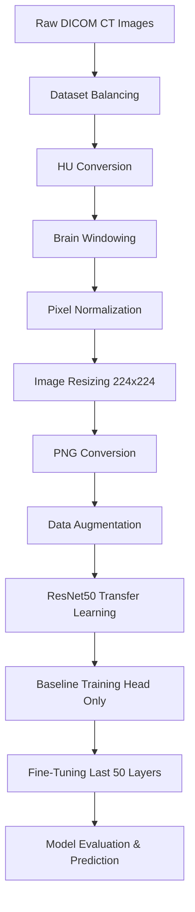

# Brain Hemorrhage Detection using Deep Learning

Automated brain hemorrhage detection system using deep learning and transfer learning techniques. The model is built on the **ResNet50** architecture and trained on the **RSNA Intracranial Hemorrhage Detection** dataset. The system performs multi-label classification to identify five types of hemorrhage from CT brain scans.

---

## Table of Contents
1. [Overview](#overview)
2. [Dataset Details](#dataset-details)
3. [Technologies Used](#technologies-used)
4. [Project Workflow](#project-workflow)
5. [Preprocessing Pipeline](#preprocessing-pipeline)
6. [Model Architecture & Training](#model-architecture--training)
7. [Results](#results)
8. [Folder Structure](#folder-structure)
9. [Installation & Setup](#installation--setup)
10. [Usage](#usage)

---

## Overview
Intracranial hemorrhage (brain bleed) is a life-threatening medical emergency. Rapid and accurate detection is critical. This project implements an automated pipeline to preprocess DICOM CT scans, balance classes, train a deep ResNet50 model, and output multi-label prediction confidence scores for five distinct bleed types.

---

## Dataset Details
- **Source**: RSNA Intracranial Hemorrhage Detection (Kaggle)
- **Scale**: Approximately 750,000 CT scan slices (original dataset)
- **Selected Cohort**: 16,000 balanced CT images (8,000 Normal / 8,000 Hemorrhage)

### Target Hemorrhage Types
- Epidural
- Intraparenchymal
- Intraventricular
- Subarachnoid
- Subdural

---

## Technologies Used
- **Languages & Frameworks**: Python, TensorFlow, Keras
- **Image Processing**: OpenCV, Pydicom
- **Data Wrangling**: NumPy, Pandas, Scikit-learn
- **Visualization**: Matplotlib
- **Environments**: Google Colab / Kaggle Notebooks

---

## Project Workflow


---

## Preprocessing Pipeline
1. **Hounsfield Unit (HU) Conversion**: Rescaling pixel values to match Hounsfield Units using DICOM metadata (`RescaleSlope` and `RescaleIntercept`).
2. **Brain Windowing**: Restricting the density range to a window center of 40 HU and width of 80 HU to emphasize brain tissues.
3. **Normalization**: Scaling pixel intensities linearly to the `[0, 1]` range.
4. **Resizing**: Resampling the images to `224 × 224` to fit ResNet50's default input resolution.
5. **PNG Conversion**: Writing preprocessed slices as 8-bit grayscale PNGs.

---

## Model Architecture & Training

### Backbone
- **Base Architecture**: ResNet50 (pre-trained on ImageNet)
- **Global Pooling**: Global Average Pooling 2D
- **Classification Head**: Custom layers with Batch Normalization, Dense (512, ReLU), Dropout (0.5), Dense (128, ReLU), Dropout (0.3), and Dense (5, Sigmoid) outputs.

### Training Stages
| Stage | Description | Trainable Layers | Epochs | Learning Rate |
| :--- | :--- | :--- | :---: | :---: |
| **Baseline** | Training classification head only | Custom Head Only | 10 | 0.0001 |
| **Fine-Tuning** | Unfreezing top convolution layers | Last 50 Layers + Head | 10 | 0.00001 |
| **Final Optimization** | Final parameter adjustment | Last 50 Layers + Head | 3 | 0.000001 |

---

## Results
- **Training Accuracy**: ≈ 90%
- **Validation Accuracy**: ≈ 89%
- **Area Under ROC Curve (AUC)**: ≈ 0.89
- **Training Loss**: ≈ 0.23
- **Validation Loss**: ≈ 0.26

---

## Folder Structure
```text
Brain-Hemorrhage-Detection/
│
├── preprocessing.py      # DICOM conversion, balancing & splitting pipeline
├── train.py              # Model compilation, baseline & fine-tuning script
├── predict.py            # Single-image prediction & inference script
├── utils.py              # Helper functions for plots, logs, and labels
├── requirements.txt      # List of dependencies
└── README.md             # Project documentation
```

---

## Installation & Setup

1. Clone this repository:
   ```bash
   git clone https://github.com/<your-username>/Brain-Hemorrhage-Detection.git
   cd Brain-Hemorrhage-Detection
   ```
2. Install dependencies:
   ```bash
   pip install -r requirements.txt
   ```

---

## Usage

### 1. Preprocessing
To balance, split, and convert your raw DICOM files to PNGs, configure the path variables in `preprocessing.py` and run:
```bash
python preprocessing.py
```

### 2. Model Training
To train the baseline and fine-tune the ResNet50 network, run:
```bash
python train.py
```

### 3. Inference / Prediction
To run inference on a random image from the test set, run:
```bash
python predict.py
```
